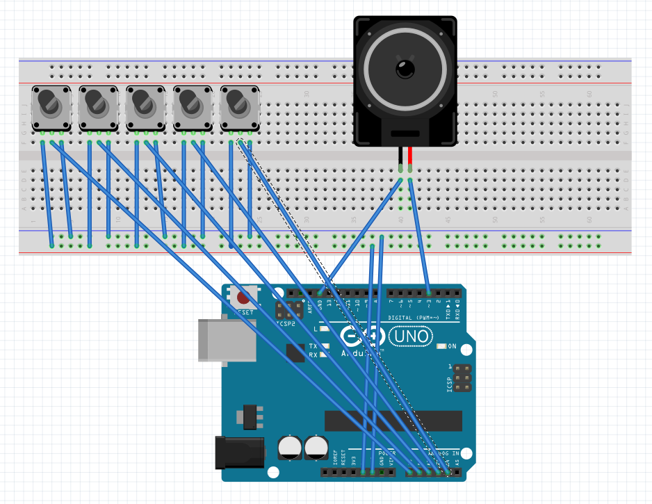

## česky

# Syntezátor na Arduino Uno

Tento projekt přináší jednoduchý monofonní syntezátor postavený na platformě Arduino Uno. Kód je odvozen od původního projektu uživatele [chariscat](https://projecthub.arduino.cc/profiles/chariscat) na Arduino Project Hub. Výsledkem je plně funkční syntezátor generující zvuk pomocí PWM výstupu Arduino, jehož parametry se ovládají pěti analogovými potenciometry.

### Obsah repositáře

* **Synth.ino** – hlavní zdrojový kód v C++ pro Arduino
* **schematic.PNG** – schéma zapojení komponent
* **poster.png** – návrh plakátu / letáku k projektu
* **blackbox.step** – 3D CAD model krabičky (formát STEP)
* **README.md** – (tento) podrobný popis

### Hardwarové požadavky

* **Arduino Uno** (nebo obdobná deska s ATMega328P)
* **5× potenciometr 10 kΩ** pro ovládání parametrů
* **50 W reproduktor** nebo sluchátkový zesilovač
* **Jumper kabely** (dupont) pro propojování
* (volitelné) **3D tištěná krabička** dle souboru `blackbox.step`

### Schéma zapojení

Podle souboru **schematic.PNG** spojte:

1. PWM výstup (pin 9) → reproduktor
2. Piny A0–A4 → střední nožky pěti potenciometrů
3. Kraje potenciometrů na 5 V a GND
4. GND Arduina také na GND reproduktoru / zesilovače



### Instalace a spuštění

1. Stáhněte nebo naklonujte repositář:

   ```bash
   git clone https://github.com/45676f725a75796576/ArduinoSynthesizer.git
   ```
2. Otevřete `Synth.ino` v Arduino IDE.
3. Připojte Arduino k PC a vyberte správný port a desku.
4. Nahrajte kód pomocí tlačítka **Upload**.
5. Po nahrání otáčením potenciometrů měňte parametry zvuku.

### Popis funkcí

* **Ovládání tónu** (Tone): jeden potenciometr upravuje základní frekvenci (v rozsahu cca 100 Hz – 2 kHz).
* **Vlnové tvary** (Waveform): výběr mezi pilou, čtverec, trojúhelník (přepínání v kódu nebo dalším přepínačem).
* **Rezonance / filtr** (Filter): potlačení vyšších harmonických – jednoduchý RC filtr.
* **Obálka** (Envelope): ADSR (attack, decay, sustain, release) realizováno softwarově – tři potenciometry pro Attack/Decay, Sustain/Release.
* **Hlasitost** (Volume): master volume potenciometrem.

### Kód (krátké shrnutí)

V souboru `Synth.ino` je:

* Nastavení pinu `9` pro PWM výstup.
* Funkce `readPots()` pro čtení analogových vstupů A0–A4.
* Generátor vln v přerušení časovače Timer1, generující vzorky v zadaném vzorkovacím kmitočtu (např. 31 kHz).
* Softwarová obálka ADSR aplikovaná na výsledný vzorek před odesláním na PWM.

### 3D krabička

V souboru **blackbox.step** najdete kompletní 3D model pro tisk krabičky, ve které jsou vyříznuté otvory pro potenciometry, reproduktor a USB konektor. Stačí importovat do CAD programu (Fusion 360, FreeCAD) a exportovat STL.

### Poster

Obrázek **poster.png** lze použít pro prezentaci projektu na výstavách či soutěžích. Obsahuje stručné schéma a popis funkcí.

### Budoucí rozšíření

* Přidání polyfonie (vícehlasý syntezátor)
* MIDI vstup pro řízení z externí klávesnice
* Rozšířený filtr (LFO, rezonátor)
* Vylepšená obálka s hardwarovým spínačem pro hold

---

## English

# Arduino Synthesizer

This project implements a simple monophonic synthesizer on an Arduino Uno. The code originates from user [chariscat](https://projecthub.arduino.cc/profiles/chariscat) on the Arduino Project Hub. The synthesizer uses PWM output on the Arduino to generate audio, with parameters controlled via five analog potentiometers.

### Repository contents

* **Synth.ino** – main Arduino C++ source file
* **schematic.PNG** – wiring diagram for all components
* **poster.png** – project poster/flyer design
* **blackbox.step** – 3D CAD model of the enclosure (STEP format)
* **README.md** – (this) detailed documentation

### Hardware requirements

* **Arduino Uno** (or any ATMega328P-based board)
* **5× 10 kΩ potentiometers** to control parameters
* **50 W speaker** or headphone amplifier
* **Jumper (dupont) wires** for connections
* Optional: **3D-printed enclosure** from `blackbox.step`

### Wiring diagram

According to **schematic.PNG**, connect:

1. PWM output (pin 9) → speaker/amplifier input
2. Pins A0–A4 → wiper pins of the five potentiometers
3. Potentiometer outer pins to +5 V and GND
4. Common GND between Arduino and speaker/amplifier


### Installation & Usage

1. Clone the repository:

   ```bash
   git clone https://github.com/45676f725a75796576/ArduinoSynthesizer.git
   ```
2. Open `Synth.ino` in the Arduino IDE.
3. Connect Arduino via USB, select the correct board and port.
4. Click **Upload** to flash the code.
5. Once uploaded, rotate the potentiometers to sculpt your sound.

### Feature overview

* **Tone control**: one potentiometer adjusts the base frequency (approx. 100 Hz to 2 kHz).
* **Waveform selection**: choose between sawtooth, square, and triangle waves (via code switch or external toggle).
* **Filter/Resonance**: simple RC filter attenuates higher harmonics.
* **Envelope (ADSR)**: implemented in software using three pots for Attack/Decay, Sustain/Release.
* **Volume control**: master volume via potentiometer.

### Code summary

In **Synth.ino** you will find:

* PWM setup on pin `9`.
* `readPots()` function to sample analog inputs A0–A4.
* Waveform generator in Timer1 interrupt, outputting at a defined sample rate (e.g., 31 kHz).
* Software ADSR envelope applied per-sample before PWM output.

### 3D Enclosure

Load **blackbox.step** into any CAD software (e.g., Fusion 360, FreeCAD) to export STL files for 3D printing. The enclosure has cutouts for potentiometers, speaker, and USB connector.

### Poster

Use **poster.png** for showcasing the project at fairs or contests. It includes a schematic overview and feature list.

### Future enhancements

* Implement polyphony (multi-voice synthesis)
* Add MIDI input for external keyboard control
* Extend filter section (LFO, resonance circuit)
* Hardware switch for envelope hold mode

---

**Licence & Credits**
Kód je licencován volně pro nekomerční použití. Velké díky uživateli chariscat za původní inspiraci a základní implementaci. / Code is provided under a permissive, non-commercial licence. Thanks to chariscat for the original code base and inspiration.
